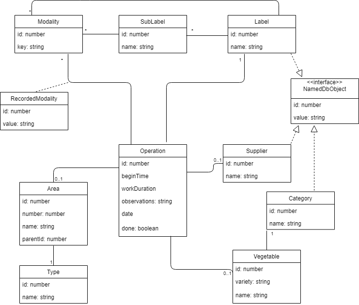

# Database description

The database will be created on [Ionic Storage](https://ionicframework.com/docs/building/storage).
Ionic Storage should use SQLite as its driver on Android and iOS devices.

## List of Storage keys

Area :

* area : the list of areas
* type : the list of area types

Operation :

* operation
* vegetable
* vegetableName
* supplier
* category

Modalities :

* label
* sublabel
* modality

## UML diagram

